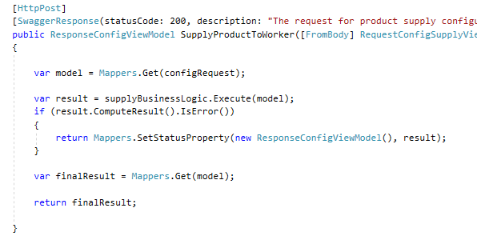
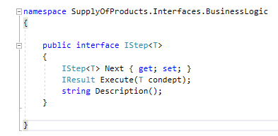
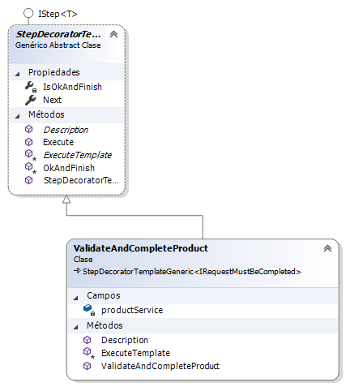
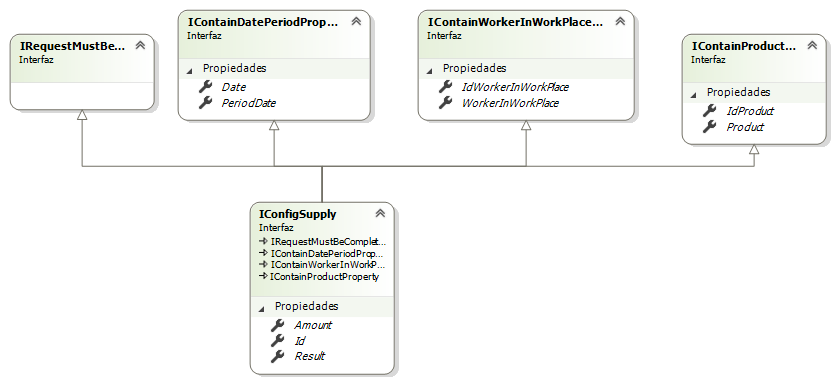

# Proyectos

El módulo está compuesto por llos siguientes proyectos y dlls

* SupplyOfProducts.API: proyecto web

* SupplyOfProducts.BusinessLogic: Lógica de Negocio (dll)

* SupplyOfProducts.Entities: Entidades del sistema (dll)

* SupplyOfProducts.Interfaces: Todas las interfaces del sistema, desde las de negocio, las de modelo/entidad, hasta los repositorios,etc (dll)

* SupplyOfProducts.Persistence: implementa la peristencia del sistema (en memoria) (dll)

* SupplyOfProducts.PersistenceDDBB: implementa la peristencia del sistema (en base de datos) (dll)

* SupplyOfProducts.Test: Test unitarios para agilizar el desarrollo y testing.


# SupplyOfProducts.API

Proyecto web que ofrece servicios web RESTful. Estos son los siguientes:

* ConfigProductController:  Configuración de Suministro de productos

* SupplyProductController:  Suministro de Productos

* WorkerController: Informe de productos suministrados al trabajador

Estos controladores, siguen un patrón básico en la implementación de sus métodos (susceptible de ser reemplezados por genéricos).




    1) Obtener el parametro pasado por GET o  POST
    2) Mapearlo a una interfaz de negocio
    3) Invocar a la capa de negocio, definida por la siguiente interfaz




   
    4) Mapear la interfaz de negocio a su correspondiente Json resultado.


## Patrón: Chain of Responsability 

Las clases que implementan IStep<T>, estan implementando el patrón Cadena de responsabilidad.  (Para mirar más detalles del patrón, hacer click aquí..) [https://es.wikipedia.org/wiki/Cadena_de_responsabilidad]

Cada clase (o paso) componente de la cadena de responsabilidad `IResult Execute(T context)` irá validando y completando la request original. 

* Si un paso puede completar su cometido hara una petición su siguiente y asi sucesivamente hasta completar el servicio de la petición. 

* Por otro lado, en el caso de que la petición no pueda ser atendida, retornará un error por IResult lo que provocará que se devuelva finalmente un Json comunicando el error.

Cada clase o paso, tendrá a su disposición los servicios que necesite, los cuales ya se habrán inyectado en el fichero Startup `public void ConfigureRepositoryServices(IServiceCollection services)`


Por ejemplo, para la interfaz IConfigSupply ( que representa la petición de configuración de suministro) tendremos estos pasos

 ``` [language]
services.AddTransient(sp =>
    HelperStepConfigurator(
    new List<IStep<IConfigSupply>>()
    {
        new ValidateRequestAndComplete<IConfigSupply>(...),
        new ValidateAndCompleteWorkerCanBeConfigured(..., ...),
        new ScheduleConfigurationToWorker(...)
    }));
```

* ValidateRequestAndComplete: cuando este paso es completado, los códigos de worker, workplace, el vinculo entre ambos, etc ya se habrán validado y completado la petición donde proceda.

* ValidateAndCompleteWorkerCanBeConfigured: cuando este paso se haya implemetntado, las validaciones entre la nueva configuración y la cantidad de productos validados para la fecha de validación, se habrán ya validado y completado. 

* ScheduleConfigurationToWorker: cuando este paso se haya ejecutado, la información del suministro debe de haberse almacenado en el sistema.

### Ventajas

* si se quisiera implementar un nuevo o varios requisitos de validación, se podría hacer en nuevas clases que implementen la interfaz `IStep<IConfigSupply>` y posteriormente incluirlas en el fichero de Startup. 

```[language]
new ValidateRequestAndComplete<IConfigSupply>(...),
new ValidateAndCompleteWorkerCanBeConfigured(...), 
new VALIDATIONX(...),
new ScheduleConfigurationToWorker(...)
```

nota: Esta modificación del fichero de Startup se podría subsanar con una configuracion por fichero XML/JSON de la dependencia. 

* Por otro lado, si tuvieramos varios clientes con sus propias reglas de  configuración, se podría obtener con lo dicho en el punto anterior.

## Patrón: Método Template

Cada paso o clase de la cadena de responsabilidad, sigue un algoritmo-soporte que de no implementarse usando patrón "método template" habría que ir replicando en cada clase con los inconvenientes que ello tiene en cuanto a mantenimiento.

 (Para mirar más detalles del patrón, hacer click aquí..) [https://es.wikipedia.org/wiki/Patr%C3%B3n_de_m%C3%A9todo_de_la_plantilla]

 La idea es que las clases de la cadena al heredar de la clase base `StepDecoratorTemplateGeneric` ya tenga ese soporte y sólo tengan que focalizarse en la funcionalidad que tiene que implementar.

 La clase método template, implementará la interfaz IStep<T>. Esto no quita que se pueda implementar directamente pero perderíamos dicho soporte.

 


## Segregación de interfaces

La interfaz `IConfigSupply` se cogerá como ejemplo de cómo se han segregado las interfaces. 



Los pasos o clases iniciales implementan la interfaz `IStep<IRequestMustBeCompleted>`.Como se puede apreciar, la interfaz no aporta ningún método o propiedad.

Entonces, por ejemplo, si nos fijamos en la implementación de la validación del código de producto (`ValidateAndCompleteProduct`), se tendría  algo así como:

```[language]
protected override IResult ExecuteTemplate(IRequestMustBeCompleted obj)
{
    if (obj is IContainProductProperty)
    {
        var objCasted = (IContainProductProperty)obj;
        var productObject = productService.Get(objCasted.Product.Code);
        if (productObject != null)
        {
            objCasted.Product = productObject;
            objCasted.IdProduct = productObject.Id;
        }


        if (objCasted.Product == null || objCasted.IdProduct == 0)
        {
            return new Result(EnumResultBL.ERROR_PRODUCT_REQUIRED, objCasted.Product.Code);
        }
    }

    return Result.Ok;
}
```

La idea sería la de trabajar contra interfaz, así si el parámetro además de implementar la interfaz `IRequestMustBeCompleted` también implementa la interfaz `IContainProductProperty`, entonces será procesado y si no, se proseguirá con la ejecución del siguiente paso.

Si durante su ejecución hubiera un error, éste se devolvería impidiendo que se ejecutaran el resto de pasos.

Por otro lado, si no implementará la interfaz `IContainProductProperty`, esta clase no deberia de hacer nada y por tanta devuelve un OK

Esta validación es reutilizada en otras interfaces como la ya existente IProductSupply. 

Con esta abstracción, si una futura interfaz que represente a otra request, tiene que validar un código de producto, tan sólo tendria que heredar de ambas interfaces como así hace `IConfigSupply`.

## SupplyOfProducts.BusinessLogic

Es la capa de la lógica de negocio donde estarán alojados:

- Los código de error de la aplicación
- La implementación de los Servicios
- La implementación de los Steps que componen la cadena de responsabilidad

## SupplyOfProducts.Entities

Es la capa que define las entidades de dominio, divida en los bloques

- Configuration
- Provision

## SupplyOfProducts.Interfaces

Es la dll que define las interfaces del sistema a todos los niveles.

- interfaces de Negocio
- interfaces de Repositorio
- interfaces de Modelo

## SupplyOfProducts.Persistence

Es la capa que implementa las interfaces de repositorio

## SupplyOfProducts.Test

Test unitarios.


# Futuro Roadmap del supuesto y objetivos personales

## Implementaciones

1) Implementar capa de persistencia con SQL Server (60%)
2) Implementar “Unit of Work” e integración en la Cadena de Responsabilidad (90%)
3) Implementar una interfaz Async / await para lanzar pasos/validaciones independientes entre si
  3.1)  Terminar de documentar conclusiones del supuesto Async/Await y aplicarlo en este
  
  
  [Async/Await](https://github.com/ANG78/Proof-Of-Concept-Async/blob/master/README.md)
  
4) Implementar a modo de ejemplo,  ventajas de Implementar la cadena de responsabilidad
5) Serializar el acceso a ciertos pasos de la Cadena de Responsabilidad


## Documentar las siguientes cuestiones de Diseño y a ciertos paradigmas

1) Cadena de Responsabilidad embebida en los servicios Vs o capa de Servicios que invoca a la cadena  
2) Trabajar contra interfaces en las propiedades de las Entidades de Negocio: PROS y CONTRAS
3) EF:  Como mapear FK en el caso de Product / Package
4) Seguir documentando ventajas de Cadena de Responsabilidad.
4.1) Reflejar las posibilidades de configuración y como mejorar el performance
4.2) Cómo diseñar casos de test por cada posible flujo o concurrencia.
